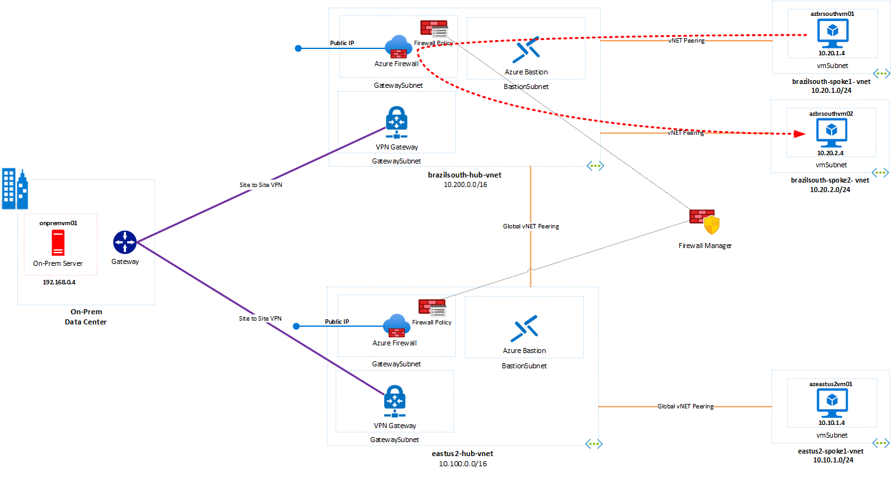

# Challenge 1: Intra-Forwarding Connection

[< Previous Challenge](./00-prereqs.md) - **[Home](../README.md)** - [Next Challenge >](./02-acr.md)

## Introduction

The first step in our journey will be to take a set up a communication between two spokes virtual networks through Azure Firewall. At the end of the challenge, you will complete the setup and will have the Intra-region forwarding in place.


## Description

In this challenge, you will establish communication between spokes virtual networks using a firewall inside the hub virtual network to forward the networking traffic to the same region. You will then inspect effective routes on the spoke VMs and run the simple ping test.

#### Task 1 - Deploy a User Defined Route for spokes virtual networks

Connect to **azbrazilsouthvm01** via Bastion, open the command prompt and try to ping the **azbrazilsouthvm02**.

:question: What is the result?

Check the routing on **azbrsouthvm01**, using the Azure Cloud Shell:

```azure cli
az network nic show-effective-route-table -g wth-azurefirewall-rg -n azbrsouthvm01-nic --output table
```
:question: Any route to **azbrsouthvm02**?

Configure a existing route table using the Azure Cloud Shell for subnet on the spokes virtual networks in Brazil South region.

```bash
az network route-table route create --name to-brazilsouth-spoke2 --resource-group wth-azurefirewall-rg --route-table-name brazilsouth-spokes-rt --address-prefix 10.20.2.0/24 --next-hop-type VirtualAppliance --next-hop-ip-address 10.200.3.4
az network route-table route create --name to-brazilsouth-spoke1 --resource-group wth-azurefirewall-rg --route-table-name brazilsouth-spokes-rt --address-prefix 10.20.1.0/24 --next-hop-type VirtualAppliance --next-hop-ip-address 10.200.3.4
az network vnet subnet update --name vmsubnet --vnet-name brazilsouth-spoke1-vnet  --resource-group wth-azurefirewall-rg  --route-table brazilsouth-spokes-rt
az network vnet subnet update --name vmsubnet --vnet-name brazilsouth-spoke2-vnet  --resource-group wth-azurefirewall-rg  --route-table brazilsouth-spokes-rt
```

Verify again the routing on **azbrsouthvm01** using the Azure Cloud Shell or Azure Portal.

#### Task 2 - Deploy Network rules trought the Firewall Policies

After you finish the setup for UDR (**Task 1**) try to use ping tool between the virtual machines (**azbrsouthvm01 - 10.20.1.4** and **azbrsouthvm02 - 10.20.2.4**) and ckeck on the results in the Azure Log Analytics. You can use the below Kusto Query:

```bash
AzureDiagnostics
| where Category == "AzureFirewallNetworkRule" and msg_s contains "10.20.1.4" and msg_s contains "ICMP"
| parse msg_s with Protocol " request from " SourceIP ":" SourcePortInt:int " to " TargetIP ":" TargetPortInt:int *
| parse msg_s with * ". Action: " Action1a
| parse msg_s with * " was " Action1b " to " NatDestination
| parse msg_s with Protocol2 " request from " SourceIP2 " to " TargetIP2 ". Action: " Action2
| extend
SourcePort = tostring(SourcePortInt),
TargetPort = tostring(TargetPortInt)
| extend 
    Action = case(Action1a == "", case(Action1b == "",Action2,Action1b), Action1a),
    Protocol = case(Protocol == "", Protocol2, Protocol),
    SourceIP = case(SourceIP == "", SourceIP2, SourceIP),
    TargetIP = case(TargetIP == "", TargetIP2, TargetIP)
| project TimeGenerated, msg_s, Protocol, SourceIP,TargetIP,Action,Resource
```


In the portal, navigate to the **Firewall Policies** named **azfw-policy-std**. Click on "Network Rules" under "Settings", and click "+ Add a rule collection " at the top of the page. 

Under the "Add a rule collection", follow the below steps:

- Name: **rule-allow-spokes-communication**
- Rule collction type: **Network**
- Priority: **100**
- Rule Collection Action: **Allow**
- Rule Collection Group: **DefaultNetworkRuleCollectionGroup**
- Rules
    - Name: **to-spoke1**
    - Source Type: **IP Address**
    - Source: **10.20.2.4**
    - Protocol: **ICMP**
    - Destination Ports: *
    - Destination Type: **IP Address**
    - Destination: **10.20.1.4**

    - Name: **to-spoke2**
    - Source Type: **IP Address**
    - Source: **10.20.1.4**
    - Protocol: **ICMP**
    - Destination Ports: *
    - Destination Type: **IP Address**
    - Destination: **10.20.2.4**

Wait for the complete the configuration. 

:question: Can you reach the virtual machine **azbrsouthvm01 - 10.20.1.4** from **azbrsouthvm02 - 10.20.2.4** using the ping tool?

## Success Criteria

1. You can reach out the virtual machine in the spoke2 vnet.
2. You have updated 2 route table for both spoke1 and spoke2.
3. You can run ping tool to test the connection between virtual machines.

## Learning Resources

- [Virtual network traffic routing ](https://docs.microsoft.com/en-us/azure/virtual-network/virtual-networks-udr-overview)</br>
- [Azure Firewall rule processing logic ](https://docs.microsoft.com/en-us/azure/firewall-manager/rule-processing)</br>
- [Azure Firewall Manager policy overview ](https://docs.microsoft.com/en-us/azure/firewall-manager/policy-overview)</br>
- [Deploy and configure Azure Firewall and policy using the Azure portal ](https://docs.microsoft.com/en-us/azure/firewall/tutorial-firewall-deploy-portal-policy)<
