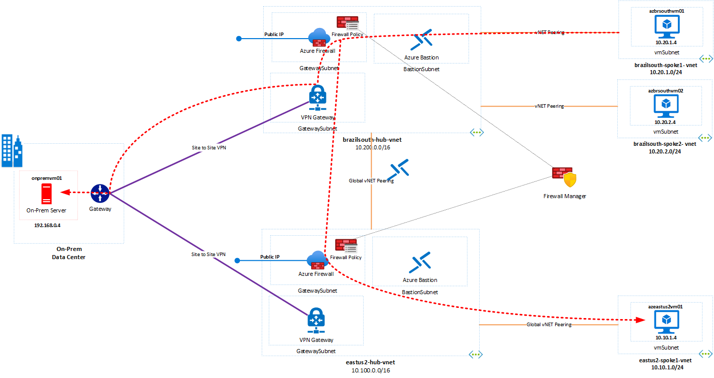

# Challenge 1: Inter-Forwarding and On-premisses Connection

[< Previous Challenge](./00-prereqs.md) - **[Home](../README.md)** - [Next Challenge >](./02-acr.md)

## Introduction

Now you will explore other resoruces to complete the challenge and estabilsh the communication between other region and local datacenter.  At the end of the challenge, you will complete the setup and will have this scenario in place.



## Description

You will expand communication by adding a Hub with a virtual network in the US East2 region and an On-premises environment. These elements are gone deploy, and your goal is to create the routing between regions and on-premises environment, inspect it, and test with the ping tool the communication between virtual machines.

#### Task 1 - Verify route table in the existing User Defined Route (UDR)

Connect to **azbrazilsouthvm01 - 10.20.1.4** via Bastion, open the command prompt and try to ping the  **azeastus2vm01 - 10.10.1.4** and **onpremvm01 - 192.168.0.4**.

:question: What is the result?

Check the routing on **azbrsouthvm01**, using the Azure Cloud Shell:

```bash
az network nic show-effective-route-table -g wth-azurefirewall-rg -n azbrsouthvm01-nic --output table
```

:question: Any route to **azeastus2vm01** and **onpremvm01**?

Set up rule on the an existing routing table using the Azure Cloud Shell for the subnet on the spokes virtual networks in Brazil South and EastUS2 regions. These routes will permit that you reach the virtual machines in both regions.

```bash
az network route-table route create --name to-eastus2-spoke1 --resource-group wth-azurefirewall-rg --route-table-name brazilsouth-spokes-rt --address-prefix 10.10.1.0/24 --next-hop-type VirtualAppliance --next-hop-ip-address 10.200.3.4
az network route-table route create --name to-brazil-spoke1 --resource-group wth-azurefirewall-rg --route-table-name eastus2-spokes-rt --address-prefix 10.20.1.0/24 --next-hop-type VirtualAppliance --next-hop-ip-address 10.100.3.4
az network vnet subnet update --name vmsubnet --vnet-name eastus2-spoke1-vnet --resource-group wth-azurefirewall-rg --route-table eastus2-spokes-rt
```

:exclamation: You still will need to manipulate the routing table (UDR) to reach the virtual machines in the East US or Brazil South regions through two Azure Firewall instances.

Note on the diagram we have four route tables on the different VNETs present in the environment, and each contains routes for the specific prefixes of connected VNETs. This table decides where traffic is sent from the virtual machines.
 


```bash
az network route-table route create --name to-eastus2-spoke1 --resource-group wth-azurefirewall-rg --route-table-name brazilsouth-intercnn-rt --address-prefix 10.10.1.0/24 --next-hop-type VirtualAppliance --next-hop-ip-address 10.100.3.4
az network route-table route create --name to-internet --resource-group wth-azurefirewall-rg --route-table-name brazilsouth-intercnn-rt --address-prefix 0.0.0.0/0 --next-hop-type Internet
az network route-table route create --name to-onprem --resource-group wth-azurefirewall-rg --route-table-name brazilsouth-intercnn-rt --address-prefix 192.168.0.0/24 --next-hop-type VirtualNetworkGateway
az network route-table route create --name to-brazilsouth-spoke1 --resource-group wth-azurefirewall-rg --route-table-name eastus2-intercnn-rt --address-prefix 10.20.1.0/24 --next-hop-type VirtualAppliance --next-hop-ip-address 10.200.3.4
az network route-table route create --name to-internet --resource-group wth-azurefirewall-rg --route-table-name eastus2-intercnn-rt --address-prefix 0.0.0.0/0 --next-hop-type Internet
az network vnet subnet update --name AzureFirewallSubnet --vnet-name brazilsouth-hub-vnet  --resource-group wth-azurefirewall-rg --route-table brazilsouth-intercnn-rt
az network vnet subnet update --name GatewaySubnet --vnet-name brazilsouth-hub-vnet  --resource-group wth-azurefirewall-rg --route-table brazilsouth-gwsubnet-rt
az network vnet subnet update --name AzureFirewallSubnet --vnet-name eastus2-hub-vnet  --resource-group wth-azurefirewall-rg --route-table eastus2-intercnn-rt
```

Look at routing on **azbrsouthvm01** using the Azure Cloud Shell or Azure Portal, and verify if exist a route to reach the virtual machine **azeastus2vm01** or **onpremvm01**.

#### Task 2 - Set up Network rules trought at Firewall Policies in eactch Azure Firewall Instances

After you finish the setup for UDR (**Task 1**) try to use ping tool between the virtual machines and ckeck on the results in the Azure Log Analytics for each Firewall instances. You can use the below Kusto Query:

```bash
AzureDiagnostics
| where Category == "AzureFirewallNetworkRule" and msg_s contains "10.20.1.4" and msg_s contains "ICMP"
| parse msg_s with Protocol " request from " SourceIP ":" SourcePortInt:int " to " TargetIP ":" TargetPortInt:int *
| parse msg_s with * ". Action: " Action1a
| parse msg_s with * " was " Action1b " to " NatDestination
| parse msg_s with Protocol2 " request from " SourceIP2 " to " TargetIP2 ". Action: " Action2
| extend
SourcePort = tostring(SourcePortInt),
TargetPort = tostring(TargetPortInt)
| extend 
    Action = case(Action1a == "", case(Action1b == "",Action2,Action1b), Action1a),
    Protocol = case(Protocol == "", Protocol2, Protocol),
    SourceIP = case(SourceIP == "", SourceIP2, SourceIP),
    TargetIP = case(TargetIP == "", TargetIP2, TargetIP)
| project TimeGenerated, msg_s, Protocol, SourceIP,TargetIP,Action,Resource
```


In the portal, navigate to the **Firewall Policies** named **azfw-policy-std**. Click on "Network Rules" under "Settings", and click "+ Add a rule collection " at the top of the page. 

Under the "Add a rule collection", follow the below step:

- Name: **rule-allow-icmp**
- Rule collction type: **Network**
- Priority: **110**
- Rule Collection Action: **Allow**
- Rule Collection Group: **DefaultNetworkRuleCollectionGroup**
- Rules
    - Name: **to-eastus2-and-onprem**
    - Source Type: **IP Address**
    - Source: **10.20.1.4**
    - Protocol: **ICMP**
    - Destination Ports: *
    - Destination Type: **IP Group**
    - Destination: **icmp-ipgroup**

    - Name: **to-brsouth-vmspoke1**
    - Source Type: **IP Group**
    - Source: **icmp-ipgroup**
    - Protocol: **ICMP**
    - Destination Ports: *
    - Destination Type: **IP Address**
    - Destination: **10.20.1.4**

Wait for the complete the configuration. 

:question: Can you reach the virtual machines **azeastus2vm01 - 10.10.1.4** and **onpremvm01 - 192.168.0.4** ?
## Success Criteria

1. You can reach out the virtual machine in eastus2 region and onpremisses.
2. You have updated 2 route table for both spoke1 and spoke2.
3. You can run ping tool to test the connection between virtual machines.

## Learning Resources

- [Virtual network traffic routing ](https://docs.microsoft.com/en-us/azure/virtual-network/virtual-networks-udr-overview)</br>
- [Azure Firewall rule processing logic ](https://docs.microsoft.com/en-us/azure/firewall-manager/rule-processing)</br>
- [Azure Firewall Manager policy overview ](https://docs.microsoft.com/en-us/azure/firewall-manager/policy-overview)</br>
- [Deploy and configure Azure Firewall and policy using the Azure portal ](https://docs.microsoft.com/en-us/azure/firewall/tutorial-firewall-deploy-portal-policy)</br>
- [IP Groups in Azure Firewall ](https://docs.microsoft.com/bs-latn-ba/azure/firewall/ip-groups)
