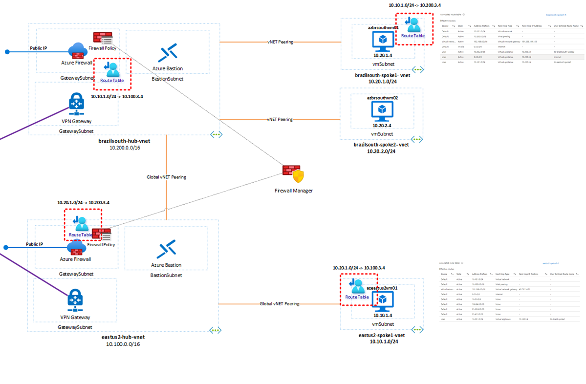

# Challenge 1: Inter-Forwarding and On-premisses Connection

[< Previous Challenge](./00-prereqs.md) - **[Home](../README.md)** - [Next Challenge >](./02-acr.md)

## Introduction

The first step in our journey will be to take a set up a communication between two spokes virtual networks through Azure Firewall. At the end of the challenge, you will complete the setup and will have the Intra-region forwarding in place.


## Description

You will expand communication by adding a Hub with a spoke virtual network in the US East2 region. These inter-connection elements are gone deploy, and your goal is to create the routing between regions, inspect it, and test with the ping tool the communication between virtual machines.

#### Task 1 - Set up rules in the existing User Defined Route (UDR)

Connect to **azbrazilsouthvm01 - 10.20.1.4** via Bastion, open the command prompt and try to ping the  **azeastus2vm01 - 10.10.1.4**.

:question: What is the result?

Check the routing on **azbrsouthvm01**, using the Azure Cloud Shell:

```azure cli
az network nic show-effective-route-table -g firewall-microhack-rg -n azbrsouthvm01-nic --output table
```
:question: Any route to **azeastus2vm01**?

Set up rule on the an existing routing table using the Azure Cloud Shell for the subnet on the spokes virtual networks in Brazil South and EastUS2 regions. These routes will permit that you reach the virtual machines in both regions.

```bash
az network route-table route create --name to-eastus2-spoke1 --resource-group firewall-microhack-rg --route-table-name brazilsouth-spoke1-rt --address-prefix 10.10.1.0/24 --next-hop-type VirtualAppliance --next-hop-ip-address 10.200.3.4
az network route-table route create --name to-brazil-spoke1 --resource-group firewall-microhack-rg --route-table-name eastus2-spoke1-rt --address-prefix 10.20.1.0/24 --next-hop-type VirtualAppliance --next-hop-ip-address 10.100.3.4
```

:exclamation: You still will need to manipulate the routing table (UDR) to reach the virtual machines in the East US or Brazil South regions through two Azure Firewall instances.

Note on the diagram we have four route tables on the different VNETs present in the environment, and each contains routes for the specific prefixes of connected VNETs. This table decides where traffic is sent from the virtual machines.
 


```bash
az network route-table route create --name to-eastus2-spoke1 --resource-group firewall-microhack-rg --route-table-name brazilsouth-interconn-rt --address-prefix 10.10.1.0/24 --next-hop-type VirtualAppliance --next-hop-ip-address 10.100.3.4
az network route-table route create --name to-internet --resource-group firewall-microhack-rg --route-table-name brazilsouth-interconn-rt --address-prefix 0.0.0.0/0 --next-hop-type Internet
az network route-table route create --name to-brazilsouth-spoke1 --resource-group firewall-microhack-rg --route-table-name eastus2-interconn-rt --address-prefix 10.20.1.0/24 --next-hop-type VirtualAppliance --next-hop-ip-address 10.200.3.4
az network route-table route create --name to-internet --resource-group firewall-microhack-rg --route-table-name eastus2-interconn-rt --address-prefix 0.0.0.0/0 --next-hop-type Internet
az network vnet subnet update --name AzureFirewallSubnet --vnet-name brazilsouth-hub-vnet  --resource-group firewall-microhack-rg  --route-table brazilsouth-interconn-rt
az network vnet subnet update --name AzureFirewallSubnet --vnet-name eastus2-hub-vnet  --resource-group firewall-microhack-rg  --route-table eastus2-interconn-rt
```

Look at routing on **azbrsouthvm01** using the Azure Cloud Shell or Azure Portal, and verify if exist a route to reach the virtual machine **azeastus2vm01**.

#### Task 2 - Set up Network rules inside the Azure Firewall instances

## Success Criteria

1. You can reach out the virtual machine in the spoke2 vnet.
2. You have updated 2 route table for both spoke1 and spoke2.
3. You can run ping tool to test the connection between virtual machines.

## Learning Resources

- [Virtual network traffic routing ](https://docs.microsoft.com/en-us/azure/virtual-network/virtual-networks-udr-overview)</br>
- [Azure Firewall rule processing logic ](https://docs.microsoft.com/en-us/azure/firewall-manager/rule-processing)</br>
- [Azure Firewall Manager policy overview ](https://docs.microsoft.com/en-us/azure/firewall-manager/policy-overview)</br>
- [Deploy and configure Azure Firewall and policy using the Azure portal ](https://docs.microsoft.com/en-us/azure/firewall/tutorial-firewall-deploy-portal-policy)<
